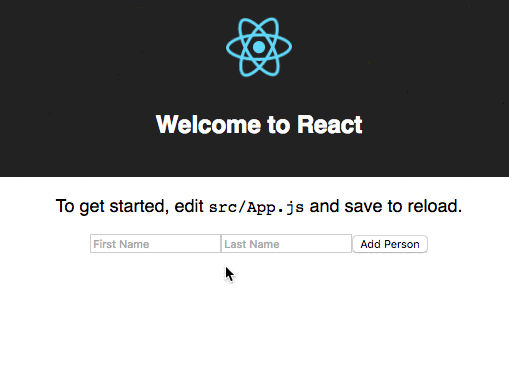

# `create-react-app` ... with Redux

This is a barebones implementation of Redux with a React app that was generated with `create-react-app`, and then ejected with `npm run eject`.

:bulb: This repository consists of two commits and only two commits.  

 1. **first commit** is the base code of a `create-react-app` app source code after eject (`npm run eject`)
 2. **second commit** are the sample additions to implement basic redux

:bulb: :bulb: It is worth noting that it is **not** required to run `npm run eject` in order to get Redux implemented in this app.  Implementing Redux in the app without ejecting is completely possible

